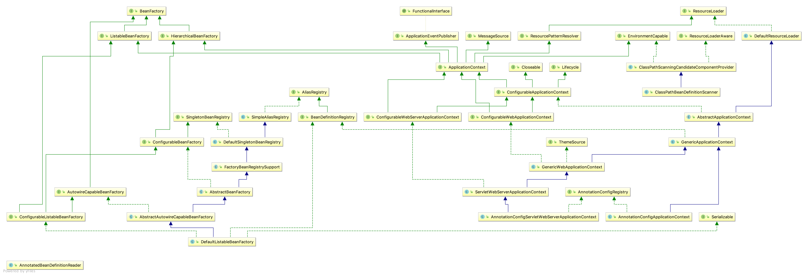

# ApplicationContext



## 总结

- 继承 ListableBeanFactory、HierarchicalBeanFactory，暴露 AutowireCapableBeanFactory [参考 BeanFactory](../BeanFactory/BeanFactory.md)
- 暴露 [Environment](../Environment/Environment.md)
- 支持消息的参数化和国际化(MessageSource)
- 支持事件发布功能([ApplicationEventPublisher](../ApplicationEventPublisher/ApplicationEventPublisher.md))
- 支持根据 path-pattern 加载 [Resource](../Resource/Resource.md)

## 接口定义

```java
public interface ApplicationContext extends EnvironmentCapable, ListableBeanFactory, HierarchicalBeanFactory,MessageSource, ApplicationEventPublisher, ResourcePatternResolver {
}
```

- ListableBeanFactory

```java
public interface ListableBeanFactory extends BeanFactory {
   boolean containsBeanDefinition(String beanName);
   int getBeanDefinitionCount();
   String[] getBeanDefinitionNames();
   String[] getBeanNamesForType(ResolvableType type);
   String[] getBeanNamesForType(@Nullable Class<?> type);
   String[] getBeanNamesForType(@Nullable Class<?> type, boolean includeNonSingletons, boolean allowEagerInit);
   <T> Map<String, T> getBeansOfType(@Nullable Class<T> type) throws BeansException;
   <T> Map<String, T> getBeansOfType(@Nullable Class<T> type, boolean includeNonSingletons, boolean allowEagerInit) throws BeansException;
   String[] getBeanNamesForAnnotation(Class<? extends Annotation> annotationType);
   Map<String, Object> getBeansWithAnnotation(Class<? extends Annotation> annotationType) throws BeansException;
   @Nullable <A extends Annotation> A findAnnotationOnBean(String beanName, Class<A> annotationType) throws NoSuchBeanDefinitionException;
}
```

- HierarchicalBeanFactory

```java
public interface HierarchicalBeanFactory extends BeanFactory {
  @Nullable BeanFactory getParentBeanFactory();
  boolean containsLocalBean(String name);
}
```

- MessageSource

```java
public interface MessageSource {
   @Nullable String getMessage(String code, @Nullable Object[] args, @Nullable String defaultMessage,    Locale locale);
   String getMessage(String code, @Nullable Object[] args, Locale locale) throws NoSuchMessageException;
   String getMessage(MessageSourceResolvable resolvable, Locale locale) throws NoSuchMessageException;
}
```

- ApplicationEventPublisher

```java
@FunctionalInterface
public interface ApplicationEventPublisher {
   default void publishEvent(ApplicationEvent event) {
      publishEvent((Object) event); 
   }
   void publishEvent(Object event);
}
```

- ResourcePatternResolver

```java
public interface ResourcePatternResolver extends ResourceLoader { 
  String CLASSPATH_ALL_URL_PREFIX = "classpath*:";
  Resource[] getResources(String locationPattern) throws IOException;
}
```

```java
public interface ResourceLoader {
  String CLASSPATH_URL_PREFIX = ResourceUtils.CLASSPATH_URL_PREFIX;//classpath:
  Resource getResource(String location);
  @Nullable ClassLoader getClassLoader();
}
```

- EnvironmentCapable

```java
public interface EnvironmentCapable {
  Environment getEnvironment();
}
```

## 方法

- @Nullable String getId();

  - 返回此应用上下文的唯一ID，可null

- String getApplicationName();

  - 返回此上下文所属的已部署的应用程序的名称

- String getDisplayName();

  - 为这个上下文返回一个友好的名称

- long getStartupDate();

  - 返回第一次加载该上下文时的时间戳

- @Nullable ApplicationContext getParent();

  - 返回父级上下文，可null

- AutowireCapableBeanFactory getAutowireCapableBeanFactory() throws IllegalStateException;

  - 为此上下文暴露 AutowireCapableBeanFactory 的功能

```java
public interface AutowireCapableBeanFactory extends BeanFactory {
int AUTOWIRE_NO = 0;
int AUTOWIRE_BY_NAME = 1;
int AUTOWIRE_BY_TYPE = 2;
int AUTOWIRE_CONSTRUCTOR = 3;
@Deprecated int AUTOWIRE_AUTODETECT = 4;
String ORIGINAL_INSTANCE_SUFFIX = ".ORIGINAL";
<T> T createBean(Class<T> beanClass) throws BeansException;
void autowireBean(Object existingBean) throws BeansException;
Object configureBean(Object existingBean, String beanName) throws BeansException;
Object createBean(Class<?> beanClass, int autowireMode, boolean dependencyCheck) throws BeansException;
Object autowire(Class<?> beanClass, int autowireMode, boolean dependencyCheck) throws BeansException;
void autowireBeanProperties(Object existingBean, int autowireMode, boolean dependencyCheck) throws BeansException;
void applyBeanPropertyValues(Object existingBean, String beanName) throws BeansException;
Object initializeBean(Object existingBean, String beanName) throws BeansException;
Object applyBeanPostProcessorsBeforeInitialization(Object existingBean, String beanName) throws BeansException;
Object applyBeanPostProcessorsAfterInitialization(Object existingBean, String beanName)
throws BeansException;
void destroyBean(Object existingBean);
<T> NamedBeanHolder<T> resolveNamedBean(Class<T> requiredType) throws BeansException;
Object resolveBeanByName(String name, DependencyDescriptor descriptor) throws BeansException;
@Nullable Object resolveDependency(DependencyDescriptor descriptor, @Nullable String requestingBeanName) throws BeansException;
@Nullable
Object resolveDependency(DependencyDescriptor descriptor, @Nullable String requestingBeanName, @Nullable Set<String> autowiredBeanNames, @Nullable TypeConverter typeConverter) throws BeansException;
}
```

## 子接口

- WebApplicationContext  暴露 ServletContext

```java
public interface WebApplicationContext extends ApplicationContext {
   String ROOT_WEB_APPLICATION_CONTEXT_ATTRIBUTE = WebApplicationContext.class.getName() + ".ROOT";
   String SCOPE_REQUEST = "request";
   String SCOPE_SESSION = "session";
   String SCOPE_APPLICATION = "application";
   String SERVLET_CONTEXT_BEAN_NAME = "servletContext";
   String CONTEXT_PARAMETERS_BEAN_NAME = "contextParameters";
   String CONTEXT_ATTRIBUTES_BEAN_NAME = "contextAttributes";
   @Nullable ServletContext getServletContext();
}
```

- ConfigurableApplicationContext 

```java
public interface ConfigurableApplicationContext extends ApplicationContext, Lifecycle, Closeable {
   String CONFIG_LOCATION_DELIMITERS = ",; \t\n";
   String CONVERSION_SERVICE_BEAN_NAME = "conversionService";
   String LOAD_TIME_WEAVER_BEAN_NAME = "loadTimeWeaver";
   String ENVIRONMENT_BEAN_NAME = "environment";
   String SYSTEM_PROPERTIES_BEAN_NAME = "systemProperties";
   String SYSTEM_ENVIRONMENT_BEAN_NAME = "systemEnvironment";
   void setId(String id);
   void setParent(@Nullable ApplicationContext parent);
   void setEnvironment(ConfigurableEnvironment environment);
   @Override ConfigurableEnvironment getEnvironment();//重新定义 getEnvironment()
   void addBeanFactoryPostProcessor(BeanFactoryPostProcessor postProcessor);
   void addApplicationListener(ApplicationListener<?> listener);
   void addProtocolResolver(ProtocolResolver resolver);
   void refresh() throws BeansException, IllegalStateException;
   void registerShutdownHook();
   @Override void close();//重新定义 close() 不抛异常 
   boolean isActive();
   ConfigurableListableBeanFactory getBeanFactory() throws IllegalStateException;
}
```

```java
public interface Lifecycle {
   void start();
   void stop();
   boolean isRunning();
}
```

```java
public interface Closeable extends AutoCloseable {
   public void close() throws IOException;
}
```

```java
public interface AutoCloseable {
  void close() throws Exception;
}
```

- ConfigurableWebApplicationContext

```java
public interface ConfigurableWebApplicationContext extends WebApplicationContext, ConfigurableApplicationContext {
   String APPLICATION_CONTEXT_ID_PREFIX = WebApplicationContext.class.getName() + ":";
   String SERVLET_CONFIG_BEAN_NAME = "servletConfig";
   void setServletContext(@Nullable ServletContext servletContext);
   void setServletConfig(@Nullable ServletConfig servletConfig);
   @Nullable ServletConfig getServletConfig();
   void setNamespace(@Nullable String namespace);
   @Nullable String getNamespace();
   void setConfigLocation(String configLocation);
   void setConfigLocations(String... configLocations);
   @Nullable String[] getConfigLocations();
}
```

- WebServerApplicationContext

```java
public interface WebServerApplicationContext extends ApplicationContext {
   WebServer getWebServer();
   String getServerNamespace();
}
```

- ConfigurableWebServerApplicationContext

```java
public interface ConfigurableWebServerApplicationContext
      extends ConfigurableApplicationContext, WebServerApplicationContext {
   void setServerNamespace(String serverNamespace);
}
```

- ReactiveWebApplicationContext

```java
public interface ReactiveWebApplicationContext extends ApplicationContext {
}
```

- ConfigurableReactiveWebApplicationContext

```java
public interface ConfigurableReactiveWebApplicationContext
      extends ConfigurableApplicationContext, ReactiveWebApplicationContext {
}
```

## 抽象类

-  AbstractApplicationContext

```java
public abstract class AbstractApplicationContext extends DefaultResourceLoader
      implements ConfigurableApplicationContext {
	private String id = ObjectUtils.identityToString(this);
  private String displayName = ObjectUtils.identityToString(this);
  //getEnvironment() -> StandardEnvironment(自定义的优先)
  protected ConfigurableEnvironment createEnvironment() {
		return new StandardEnvironment();
	}
	//getAutowireCapableBeanFactory() -> getBeanFactory() 关联
	@Override public abstract ConfigurableListableBeanFactory getBeanFactory() throws IllegalStateException;
	//维护一个 beanFactoryPostProcessors List
	@Override
	public void addBeanFactoryPostProcessor(BeanFactoryPostProcessor postProcessor) {
		this.beanFactoryPostProcessors.add(postProcessor);
	}
	//维护一个 applicationListeners Set
	@Override
	public void addApplicationListener(ApplicationListener<?> listener) {
		if (this.applicationEventMulticaster != null) {
			//AbstractApplicationEventMulticaster.ListenerRetriever#applicationListeners Set
			this.applicationEventMulticaster.addApplicationListener(listener);
		}
		this.applicationListeners.add(listener);
	}
	//初始化 ApplicationEventMulticaster -> SimpleApplicationEventMulticaster
	protected void initApplicationEventMulticaster() {
		ConfigurableListableBeanFactory beanFactory = getBeanFactory();
		if (beanFactory.containsLocalBean(APPLICATION_EVENT_MULTICASTER_BEAN_NAME)) {
			this.applicationEventMulticaster =
					beanFactory.getBean(APPLICATION_EVENT_MULTICASTER_BEAN_NAME, ApplicationEventMulticaster.class);
		}
		else {
			this.applicationEventMulticaster = new SimpleApplicationEventMulticaster(beanFactory);
			beanFactory.registerSingleton(APPLICATION_EVENT_MULTICASTER_BEAN_NAME, this.applicationEventMulticaster);
		}
	}
	@Override
	public void registerShutdownHook() {
		if (this.shutdownHook == null) {
			this.shutdownHook = new Thread(()->{
					synchronized (startupShutdownMonitor) {
						doClose();
					}
			});
			Runtime.getRuntime().addShutdownHook(this.shutdownHook);
		}
	}
	//关闭上下文
	@Override
	public void close() {
		synchronized (this.startupShutdownMonitor) {
			doClose();
			if (this.shutdownHook != null) {
				Runtime.getRuntime().removeShutdownHook(this.shutdownHook);
			}
		}
	}
	protected void doClose() {
		if (this.active.get() && this.closed.compareAndSet(false, true)) {
			LiveBeansView.unregisterApplicationContext(this);
			publishEvent(new ContextClosedEvent(this));
			if (this.lifecycleProcessor != null) {
				this.lifecycleProcessor.onClose();
			}
			destroyBeans();
			closeBeanFactory();
			onClose();
			if (this.earlyApplicationListeners != null) {
				this.applicationListeners.clear();
				this.applicationListeners.addAll(this.earlyApplicationListeners);
			}
			this.active.set(false);
		}
	}
	//刷新上下文
	@Override
	public void refresh() throws BeansException, IllegalStateException {
		synchronized (this.startupShutdownMonitor) {
			prepareRefresh();
			ConfigurableListableBeanFactory beanFactory = obtainFreshBeanFactory();
			prepareBeanFactory(beanFactory);
			try {
				postProcessBeanFactory(beanFactory);
				invokeBeanFactoryPostProcessors(beanFactory);
				registerBeanPostProcessors(beanFactory);
				initMessageSource();
				initApplicationEventMulticaster();
				onRefresh();
				registerListeners();
				finishBeanFactoryInitialization(beanFactory);
				finishRefresh();
			} catch (BeansException ex) {
				destroyBeans();
				cancelRefresh(ex);
				throw ex;
			} finally {
				resetCommonCaches();
			}
		}
	}
	//
	protected void prepareRefresh() {
		this.startupDate = System.currentTimeMillis();
		this.closed.set(false);
		this.active.set(true);
		initPropertySources();
		getEnvironment().validateRequiredProperties();
		if (this.earlyApplicationListeners == null) {
			this.earlyApplicationListeners = new LinkedHashSet<>(this.applicationListeners);
		}else {
			this.applicationListeners.clear();
			this.applicationListeners.addAll(this.earlyApplicationListeners);
		}
		this.earlyApplicationEvents = new LinkedHashSet<>();
	}
	//
	protected ConfigurableListableBeanFactory obtainFreshBeanFactory() {
		refreshBeanFactory();
		return getBeanFactory();
	}
	//
	protected void prepareBeanFactory(ConfigurableListableBeanFactory beanFactory) {
		beanFactory.setBeanClassLoader(getClassLoader());
		beanFactory.setBeanExpressionResolver(new StandardBeanExpressionResolver(beanFactory.getBeanClassLoader()));
		beanFactory.addPropertyEditorRegistrar(new ResourceEditorRegistrar(this, getEnvironment()));
		beanFactory.addBeanPostProcessor(new ApplicationContextAwareProcessor(this));
		beanFactory.ignoreDependencyInterface(EnvironmentAware.class);
		beanFactory.ignoreDependencyInterface(EmbeddedValueResolverAware.class);
		beanFactory.ignoreDependencyInterface(ResourceLoaderAware.class);
		beanFactory.ignoreDependencyInterface(ApplicationEventPublisherAware.class);
		beanFactory.ignoreDependencyInterface(MessageSourceAware.class);
		beanFactory.ignoreDependencyInterface(ApplicationContextAware.class);
		beanFactory.registerResolvableDependency(BeanFactory.class, beanFactory);
		beanFactory.registerResolvableDependency(ResourceLoader.class, this);
		beanFactory.registerResolvableDependency(ApplicationEventPublisher.class, this);
		beanFactory.registerResolvableDependency(ApplicationContext.class, this);
		beanFactory.addBeanPostProcessor(new ApplicationListenerDetector(this));
		if (beanFactory.containsBean(LOAD_TIME_WEAVER_BEAN_NAME)) {
			beanFactory.addBeanPostProcessor(new LoadTimeWeaverAwareProcessor(beanFactory));
			beanFactory.setTempClassLoader(new ContextTypeMatchClassLoader(beanFactory.getBeanClassLoader()));
		}
		if (!beanFactory.containsLocalBean(ENVIRONMENT_BEAN_NAME)) {
			beanFactory.registerSingleton(ENVIRONMENT_BEAN_NAME, getEnvironment());
		}
		if (!beanFactory.containsLocalBean(SYSTEM_PROPERTIES_BEAN_NAME)) {
			beanFactory.registerSingleton(SYSTEM_PROPERTIES_BEAN_NAME, getEnvironment().getSystemProperties());
		}
		if (!beanFactory.containsLocalBean(SYSTEM_ENVIRONMENT_BEAN_NAME)) {
			beanFactory.registerSingleton(SYSTEM_ENVIRONMENT_BEAN_NAME, getEnvironment().getSystemEnvironment());
		}
	}
	//
	protected void postProcessBeanFactory(ConfigurableListableBeanFactory beanFactory) {
	}
	//
	protected void invokeBeanFactoryPostProcessors(ConfigurableListableBeanFactory beanFactory) {
		PostProcessorRegistrationDelegate.invokeBeanFactoryPostProcessors(beanFactory, getBeanFactoryPostProcessors());
		if (beanFactory.getTempClassLoader() == null && beanFactory.containsBean(LOAD_TIME_WEAVER_BEAN_NAME)) {
			beanFactory.addBeanPostProcessor(new LoadTimeWeaverAwareProcessor(beanFactory));
			beanFactory.setTempClassLoader(new ContextTypeMatchClassLoader(beanFactory.getBeanClassLoader()));
		}
	}
	//
	protected void registerBeanPostProcessors(ConfigurableListableBeanFactory beanFactory) {
		PostProcessorRegistrationDelegate.registerBeanPostProcessors(beanFactory, this);
	}
	//
	protected void initMessageSource() {
		ConfigurableListableBeanFactory beanFactory = getBeanFactory();
		if (beanFactory.containsLocalBean(MESSAGE_SOURCE_BEAN_NAME)) {
			this.messageSource = beanFactory.getBean(MESSAGE_SOURCE_BEAN_NAME, MessageSource.class);
			if (this.parent != null && this.messageSource instanceof HierarchicalMessageSource) {
				HierarchicalMessageSource hms = (HierarchicalMessageSource) this.messageSource;
				if (hms.getParentMessageSource() == null) {
					hms.setParentMessageSource(getInternalParentMessageSource());
				}
			}
		} else {
			DelegatingMessageSource dms = new DelegatingMessageSource();
			dms.setParentMessageSource(getInternalParentMessageSource());
			this.messageSource = dms;
			beanFactory.registerSingleton(MESSAGE_SOURCE_BEAN_NAME, this.messageSource);
		}
	}
	//
	protected void onRefresh() throws BeansException {
	}
	//
	protected void registerListeners() {
		for (ApplicationListener<?> listener : getApplicationListeners()) {
			getApplicationEventMulticaster().addApplicationListener(listener);
		}
		String[] listenerBeanNames = getBeanNamesForType(ApplicationListener.class, true, false);
		for (String listenerBeanName : listenerBeanNames) {
			getApplicationEventMulticaster().addApplicationListenerBean(listenerBeanName);
		}
		Set<ApplicationEvent> earlyEventsToProcess = this.earlyApplicationEvents;
		this.earlyApplicationEvents = null;
		if (earlyEventsToProcess != null) {
			for (ApplicationEvent earlyEvent : earlyEventsToProcess) {
				getApplicationEventMulticaster().multicastEvent(earlyEvent);
			}
		}
	}
	//
	protected void finishBeanFactoryInitialization(ConfigurableListableBeanFactory beanFactory) {
		if (beanFactory.containsBean(CONVERSION_SERVICE_BEAN_NAME) &&
				beanFactory.isTypeMatch(CONVERSION_SERVICE_BEAN_NAME, ConversionService.class)) {
			beanFactory.setConversionService(
					beanFactory.getBean(CONVERSION_SERVICE_BEAN_NAME, ConversionService.class));
		}
		if (!beanFactory.hasEmbeddedValueResolver()) {
			beanFactory.addEmbeddedValueResolver(strVal -> 		    getEnvironment().resolvePlaceholders(strVal));
		}
		String[] weaverAwareNames = beanFactory.getBeanNamesForType(LoadTimeWeaverAware.class, false, false);
		for (String weaverAwareName : weaverAwareNames) {
			getBean(weaverAwareName);
		}
		beanFactory.setTempClassLoader(null);
		beanFactory.freezeConfiguration();
		beanFactory.preInstantiateSingletons();
	}
	protected void finishRefresh() {
		clearResourceCaches();
		initLifecycleProcessor();
		getLifecycleProcessor().onRefresh();
		publishEvent(new ContextRefreshedEvent(this));
		LiveBeansView.registerApplicationContext(this);
	}
}
```

## 具体类

### AnnotationConfigServletWebServerApplicationContext

- 定义

```java
public class AnnotationConfigServletWebServerApplicationContext extends ServletWebServerApplicationContext implements AnnotationConfigRegistry {
	public AnnotationConfigServletWebServerApplicationContext() {
		this.reader = new AnnotatedBeanDefinitionReader(this);
		this.scanner = new ClassPathBeanDefinitionScanner(this);
	}   
}
```

```java
public class ServletWebServerApplicationContext extends GenericWebApplicationContext
      implements ConfigurableWebServerApplicationContext {
      public ServletWebServerApplicationContext() {}
}
```

```java
public class GenericWebApplicationContext extends GenericApplicationContext
      implements ConfigurableWebApplicationContext, ThemeSource {
  public GenericWebApplicationContext() {
		super();
	}
}      
```

```java
public class GenericApplicationContext extends AbstractApplicationContext implements BeanDefinitionRegistry {
  public GenericApplicationContext() {
		this.beanFactory = new DefaultListableBeanFactory();
	}
}  
```

```java
public abstract class AbstractApplicationContext extends DefaultResourceLoader
      implements ConfigurableApplicationContext {
  public AbstractApplicationContext() {
		this.resourcePatternResolver = getResourcePatternResolver();
	}    
}
```

## AnnotationConfigApplicationContext

```java
public class AnnotationConfigApplicationContext extends GenericApplicationContext implements AnnotationConfigRegistry {
  public AnnotationConfigApplicationContext() {
		this.reader = new AnnotatedBeanDefinitionReader(this);
		this.scanner = new ClassPathBeanDefinitionScanner(this);
	}
}  
```


