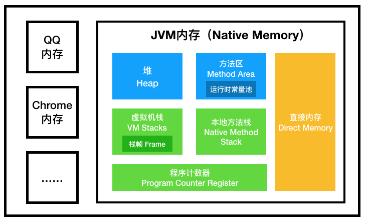

>参考：[JVM 规范系列@陈树义](https://www.cnblogs.com/chanshuyi/p/jvm_specification_00_guide.html)

## 1.引言

### 历史
- Java 编程语言是一种通用的、并发的、面向对象的语言。（**并发**、**面向对象**）
- Java 平台最初是为了解决为联网的消费者设备构建软件的问题而开发的。它被设计来支持多主机架构，并允许软件组件的安全交付。（**网络**，**安全**）
- HotJava 浏览器首先展示了java编程语言和平台的有趣特性，它使在HTML页面中嵌入程序成为可能。（**动态 Web**）
- 程序员只需编写一次程序，就可以在任何提供 Java 运行时环境的机器上运行。（**跨平台**）

### JVM
- JVM 是 Java 平台的基石。是实现硬件、操作系统的独立性，编译代码的小体积，以及保护用户免受恶意程序攻击的能力的关键部分。
- JVM 是一种抽象的计算机器。它有自己的指令集以及各种运行时内存区域。
- JVM 对 Java 编程语言一无所知，只知道一种特定的二进制格式，即 Class 文件格式（包含 JVM 指令(或字节码)和一个符号表，以及其他辅助信息）。

### 提要
- 第二章提供了 JVM 结构的概述。（**理解**）
- 第三章介绍了用 Java 编程语言编写的代码到 JVM 指令集的编译过程。（**了解**）
- 第四章特别介绍 Class 文件格式，这是一种与硬件和操作系统无关的二进制格式，用于表示已编译的类和接口。（**了解**）
- 第五章介绍了 JVM 的启动以及类和接口的加载、链接和初始化。（**掌握**）
- 第六章介绍了 JVM 指令集。（**可略过**）

## 2.JVM 结构
- JVM 规范是一种高度抽象行为的描述，而不是具体虚拟机的实现。
- 要正确地实现 JVM ，您只需能够读取类文件格式并正确地执行其中指定的操作。

### Class 文件格式
- 由 JVM 执行的已编译代码使用与硬件和操作系统无关的二进制格式表示，通常(但不一定)存储在文件中，称为 Class 文件格式。
- Class 文件格式精确地定义了类或接口的表示形式。

### 数据类型
- 与 Java 编程语言一样， JVM 操作两种数据类型：基本类型和引用类型。
- 两种类型的值可以存储在变量中，作为参数传递，通过方法返回，对其进行操作。
- JVM 期望几乎所有类型检查都在运行时之前完成，通常由编译器完成。
- JVM 包含对对象的显式支持。对象要么是动态分配的类实例，要么是数组。
- 引用类型的值视为指向对象的指针。一个对象可能存在多个引用。对象总是通过引用类型的值进行操作、传递和测试。

### 基本类型
- JVM 支持的原始类型有：numeric 类型、boolean 类型、returnAddress 类型。
- numeric 类型包含 integral 类型和 floating-point 类型。
- integral 类型：byte(8b)、short(18b)、int(32b)、long(64b)、char(16b)。
- floating-point 类型：float(32b)、double(64b)。
- boolean 类型：值为 true 或 false 。
- returnAddress 类型：指向 JVM 指令的操作码的指针。

### 引用类型
- 三种引用类型：Class 类型，数组类型，接口类型。
- 它们的值分别是对动态创建的类实例、数组或实现接口的类实例或数组的引用。

### 运行时数据区域 
- JVM 创建的数据区域
    - 堆（存储类实例和数组，被 GC 回收，会抛 OutOfMemoryError）
    - 方法区（存储类结构信息：运行时常量池、字段和方法数据，以及方法和构造函数的代码，会抛 OutOfMemoryError）
    - 运行时常量池（会抛 OutOfMemoryError）
- 每个线程的数据区域
    - pc 寄存器
    - JVM 栈 (会抛 StackOverflowError、OutOfMemoryError)
    - 本地方法栈

  

### 栈帧
- 栈帧是用来存储数据和部分过程结果的数据结构，同时也被用来处理动态链接、方法返回值和异常分派。
- 栈帧随着方法调用而创建，随着方法结束而销毁——无论方法是正常完成还是异常完成（抛出了在方法内未被捕获的异常）都算作方法结束。
- 栈帧的存储空间分配在 JVM 之中，每一个栈帧都有自己的局部变量表、操作数栈和指向当前方法所属的类的运行时常量池的引用。

#### 局部变量表
- 栈帧中局部变量表的长度由编译期决定，并且存储于类和接口的二进制表示之中，既通过方法的Code属性保存及提供给栈帧使用。
- 局部变量使用索引来进行定位访问，第一个局部变量的索引值为零，局部变量的索引值是从零至小于局部变量表最大容量的所有整数。
- 当一个实例方法被调用的时候，第 0 个局部变量一定是用来存储被调用的实例方法所在的对象的引用。

#### 操作数栈
- 每一个栈帧内部都包含一个称为操作数栈的后进先出栈。
- 每一个操作数栈的成员可以保存一个 JVM 中定义的任意数据类型的值。
> JVM 栈是存储一个个线程的信息，栈帧存储的事一个个方法的信息，操作数栈是存储方法调用中一个个操作数的信息。

#### 字节码指令
- JVM 的指令由一个字节长度的、代表着某种特定操作含义的操作码以及跟随其后的零至多个代表此操作所需参数的操作数所构成。
- 分类：加载和存储指令、运算指令、类型转换指令、对象创建指令、操作数栈管理指令、控制转移指令、方法调用和返回指令、抛出异常、同步

### 浮点运算
略过

## 3.JVM 编译
- Oracle 的 JDK 包括两部分内容：一部分是将 Java 源代码编译成 JVM 的指令集的编译器，另一部分是用于 JVM 的运行时环境。（javac、JIT）
- 即时代码生成器就是一种在Class文件中的代码被 JVM 代码加载后，生成与平台相关的特定指令的编译器。
- JVM 代码将使用 Oracle 的 javap 工具所生成的非正式的“虚拟机汇编语言”格式来描述。

## 4.Class文件格式
-  JVM 实现会在文件的链接阶段对 Class 文件进行必要的校验。

## 5.加载、链接、初始化
- 加载是根据特定名称查找类或接口类型的二进制表示，并由此二进制表示创建类或接口的过程。
- 链接是为了让类或接口可以被 JVM 执行，而将类或接口并入虚拟机运行时状态的过程。
- 类或接口的初始化是指执行类或接口的初始化方法。

### 运行时常量池
- JVM 为每个类型都维护一个常量池。
- 运行时常量池中的所有引用最初都是符号引用。

### JVM 启动
- JVM 的启动是通过引导类加载器创建一个初始类来完成。

### 类的创建和加载
- JVM 链接这个初始类，初始化并调用它的 public void main(String[]) 方法。之后的整个执行过程都是由对此方法的调用开始。
- JVM 检查引导类加载器是否是已加载过的标记为 N 的类或接口的初始加载器。如果是的话，这个类或接口就是 C，并且不再创建其它类型。否则， JVM 将参数 N 传递给引导类加载器的特定方法，以平台相关的方式搜索 C 的描述。

### 类的链接
- 类加载器需要特别考虑到类型的安全链接问题。一种可能出现的情况是，当两个不同的类加载器初始加载标记为 N 的类或接口时，在每个加载器里 N 表示着不同的类或接口。
- 在一些虚拟机实现中，在类或接口被初始化动作开始后，解析动作可能还正在进行。
- 验证阶段用于确保类或接口的二进制表示结构上是正确的。
- 准备阶段的任务是为类或接口的静态字段分配空间，并用默认值初始化这些字段。
- 解析是根据运行时常量池的符号引用来动态决定具体的值的过程。

### 类的初始化
- 触发时机：
    - 1、在执行下列需要引用类或接口的 JVM 指令时： new， getstatic， putstatic或 invokestatic
    - 2、在初次调用 java.lang.invoke.MethodHandle 实例时
    - 3、在调用 JDK 核心类库中的反射方法时
    - 4、在对于类的某个子类的初始化时
    - 5、在它被选定为 JVM 启动时的初始类时
    
### JVM 退出
- 当某个线程调用 Runtime#exit 或 System#exit 或 Runtime#halt 方法时，并且安全管理器允许 exit 或者 halt 操作时，JVM 退出。

## 6.JVM 指令集
- 一条 JVM 指令由一个特定操作的操作码和零至多个操作所使用到的操作数所构成。
- 三个保留操作码：
    - 254(0xfe) impdep1 后门
    - 255(0xff) impdep2 陷进
    - 202(0xca) breakpoint 断点
- 虚拟机可能出现的 4 个错误：
    - InternalError： JVM 实现的软件或硬件错误都会导致 InternalError 异常的出现， InternalError 是一个典型的异步异常，它可能出现在程序中的任何位置。
    - OutOfMemoryError：当 JVM 实现耗尽了所有虚拟和物理内存，并且内存自动管理子系统无法回收到足够共新对象分配所需的内存空间时，虚拟机将抛出 OutOfMemoryError 异常。
    - StackOverflowError： 当 JVM 实现耗尽了线程全部的栈空间，这种情况经常是由于程序执行时无限制的递归调用而导致的，虚拟机将会抛出 StackOverflowError异常。
    - UnknownError：当某种异常或错误出现，但虚拟机实现无法确定具体实际是哪种异常或错误的时候，将会抛出 UnknownError 异常。
